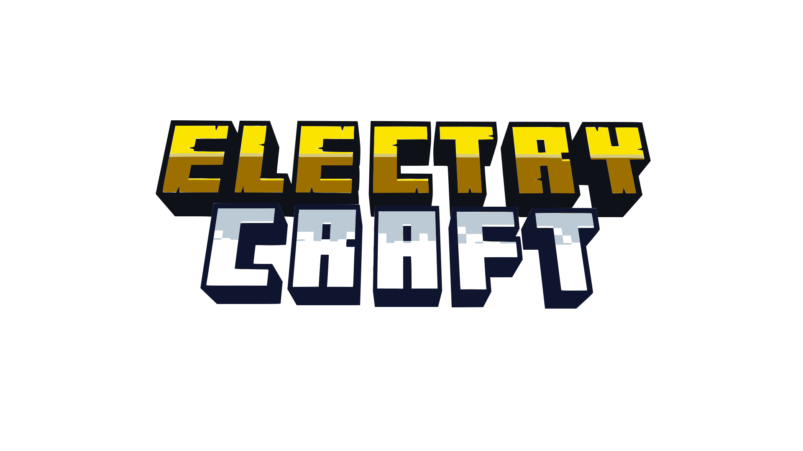

#  Fjord Launcher Unlocked

Fjord Launcher Unlocked is a **fork** of Fjord Launcher, which is a fork of Prism Launcher. It is **not** endorsed by nor affiliated with Fjord Launcher or Prism Launcher.

## Advantages of this fork over Prism Launcher

- No DRM

- [Support for alternative auth servers](doc/alternative-auth-servers.md)

## Installation

### Windows

#### [Scoop](https://scoop.sh) (recommended)

```PowerShell
scoop bucket add hero-persson https://github.com/hero-persson/scoop-unmojang
scoop install hero-persson/fjordlauncher
```

#### Windows (Manual)

You can get installers or portable builds from the [releases section](https://github.com/hero-persson/FjordLauncherUnlocked/releases/latest), MSVC builds are recommended over MinGW builds, but there's no real difference.

### macOS

#### [Homebrew](https://brew.sh) (recommended)

```Shell
brew tap hero-persson/homebrew-unmojang
brew install --cask fjordlauncher
```

#### macOS (Manual)

There are builds for macOS in the [releases section](https://github.com/hero-persson/FjordLauncherUnlocked/releases/latest).

### Flatpak

```Shell
flatpak remote-add --user --if-not-exists hero-persson https://hero-persson.github.io/unmojang-flatpak/index.flatpakrepo
flatpak install org.kde.Platform/x86_64/6.10
flatpak install org.unmojang.FjordLauncher
```

### Nix

This repository contains a Nix flake:

```Shell
nix run github:hero-persson/FjordLauncherUnlocked
```

See [nix/README.md](nix/README.md) for details.

### Other Linux

AppImages are available in the [releases section](https://github.com/hero-persson/FjordLauncherUnlocked/releases/latest).

## Building

To build the launcher yourself, follow the [instructions on the Prism Launcher website](https://prismlauncher.org/wiki/development/build-instructions), but clone this repo instead.

## Notes

- You can easily use a custom version of Loki or authlib-injector on an instance. Select the instance in the main window, go to the Version tab, delete any Yggdrasil Agents if present, click "Add Agents", and select your Yggdrasil Agent JAR. If your JAR is not correctly identified, make sure the `Agent-Class` or `Premain-Class` field in the JAR's MANIFEST.MF matches either `moe.yushi.authlibinjector.Premain` or `org.unmojang.loki.Loki`.
