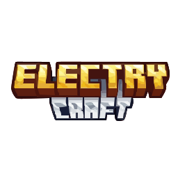

#  Fjord Launcher Unlocked

Fjord Launcher Unlocked is a **fork** of Fjord Launcher, which is a fork of Prism Launcher. It is **not** endorsed by nor affiliated with Fjord Launcher or Prism Launcher.

## Advantages of this fork over Prism Launcher

- [Support for alternative auth servers](doc/alternative-auth-servers.md)

- Offline and authlib-injector accounts don't require a Microsoft account

- Ability to download FTB modpacks from within the launcher

## Having a problem with the launcher?

You **will not** open an issue in the Prism Launcher repo.

You **will not** ask about Fjord Launcher in the Prism Launcher discord.

You **will** ask in #fjord-launcher in their [Matrix space](https://matrix.to/#/#unmojang:matrix.org).

You **will** open an issue [here](https://github.com/unmojang/FjordLauncher/issues).

## Installation

### Windows

#### [Scoop](https://scoop.sh) (recommended)

```PowerShell
scoop bucket add hero-persson https://github.com/hero-persson/scoop-unmojang
scoop install hero-persson/fjordlauncher
```

#### Windows (Manual)

You can get installers or portable builds from the [releases section](https://github.com/hero-persson/FjordLauncherUnlocked/releases/latest), MSVC builds are recommended over MinGW builds, but there's no real difference.

### macOS

#### [Homebrew](https://brew.sh) (recommended)

```Shell
brew tap hero-persson/homebrew-unmojang
brew install --cask fjordlauncher
```

#### macOS (Manual)

There are builds for macOS in the [releases section](https://github.com/hero-persson/FjordLauncherUnlocked/releases/latest).

### Flatpak

```Shell
flatpak remote-add --user --if-not-exists hero-persson https://hero-persson.github.io/unmojang-flatpak/index.flatpakrepo
flatpak install org.unmojang.FjordLauncher
```

### Arch Linux

Fjord Launcher Unlocked is [available](https://aur.archlinux.org/packages?O=0&K=fjordlauncherunlocked) from the AUR:

```Shell
paru -S fjordlauncherunlocked
paru -S fjordlauncherunlocked-git # build latest Git commit from source
```

### Nix

This repository contains a Nix flake:

```Shell
nix run github:hero-persson/FjordLauncherUnlocked
```

See [nix/README.md](nix/README.md) for details.

### Other Linux

AppImages are available in the [releases section](https://github.com/hero-persson/FjordLauncherUnlocked/releases/latest).

## Building

To build the launcher yourself, follow [the instructions on the Prism Launcher website](https://prismlauncher.org/wiki/development/build-instructions) but clone this repo instead.

## Notes

- You can easily use a custom version of authlib-injector on an instance. Select the instance in the main window, click "Edit" (or Ctrl+I/Command+I), go to the Version tab, click "Add Agents", and select your authlib-injector JAR. If your JAR is not correctly identified as authlib-injector, make sure the `Agent-Class` field in the JAR's MANIFEST.MF is `moe.yushi.authlibinjector.Premain`.
